# Laporan Proyek Akhir (UAS) - Desain Pengalaman Pengguna

**Mata Kuliah:** Desain Pengalaman Pengguna
**Program Studi:** Sistem Informasi (Semester 6)
**Dosen Pengampu:** Rizky Aditya Nugroho, S.T., M.Eng.
**Nama Mahasiswa:** [Isi Nama Anda]
**NIM:** [Isi NIM Anda]

---

## 1. Identifikasi Permasalahan
*(Aplikasi Manajemen Pre-Order (PO) & Down Payment (DP) untuk UMKM Kuliner - Sisi Admin & Pelanggan)*

*   **Latar Belakang Masalah:** 
    *   **Sisi Admin (Penjual):** Pelaku UMKM kuliner umumnya menerima pesanan (PO) melalui pesan teks seperti WhatsApp. Pencatatan manual rentan *human error*, pesanan terlewat, dan kebingungan melacak status pembayaran pelanggan (apakah baru membayar *Down Payment*/DP, atau sudah lunas).
    *   **Sisi Pelanggan:** Pelanggan sering merasa kurang terinformasi mengenai status pesanan mereka secara *real-time*, tidak memiliki rekam jejak digital terkait sisa tagihan, dan harus sering bertanya *follow-up* ke penjual mengenai jadwal pengiriman/pengambilan.
*   **Target Pengguna:** 
    *   **Admin:** Pemilik/pengelola UMKM kuliner skala kecil-menengah (usia 20-45 tahun) yang butuh sistem pencatatan digital khusus PO.
    *   **Pelanggan:** Konsumen (usia 17-50 tahun) yang memesan produk kustom/PO dan membutuhkan transparansi transaksi serta kemudahan pelacakan pesanan.
*   **Tujuan Perancangan:** 
    Merancang desain antarmuka (*User Interface*) untuk dua sisi (Admin dan Pelanggan). Sisi Admin berfokus pada efisiensi manajemen PO dan pelacakan pembayaran, sedangkan sisi Pelanggan berfokus pada kemudahan pemesanan, transparansi tagihan, dan pemantauan status pesanan.

---

## 2. User Flow
*Berikut adalah representasi visual dari alur pengguna (User Flow) untuk interaksi antara Pelanggan dan Admin.*

**Penjelasan Alur:**
1. **Pelanggan** memulai perjalanan dengan memilih produk dan membayar DP. Setelah bukti DP diunggah, data dikirim ke sisi Admin.
2. **Admin** menerima notifikasi pesanan masuk, memverifikasi pembayaran DP, lalu mengubah status pesanan.
3. Perubahan status oleh Admin akan langsung terefleksi pada halaman **Lacak Pesanan** milik Pelanggan secara *real-time*.

---

## 3. Task Flow
*Berikut adalah representasi visual dari alur tugas (Task Flow) spesifik untuk Pelanggan dan Admin.*

**A. Task Flow Admin**  
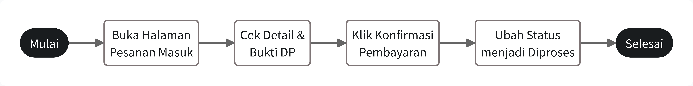

**B. Task Flow Pelanggan**  
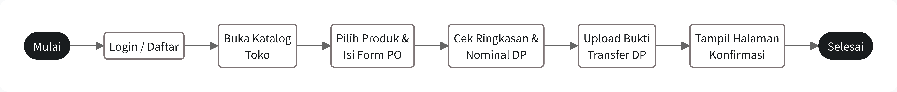

---

## 4. Wireframe (Low-Fidelity)
*Berikut adalah desain wireframe (Low-Fidelity) untuk mencakup kedua sisi (Two-Sided UI):*

**Sisi Admin:**

1. **Layar Login Admin:** Menampilkan logo toko dan form login khusus untuk pemilik usaha.
   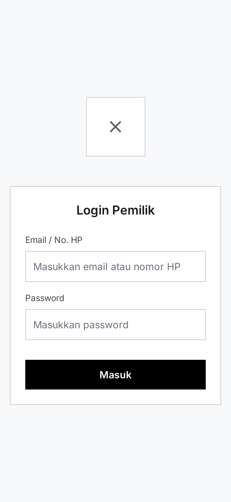

2. **Layar Dashboard Admin (Beranda):** Menampilkan ringkasan pendapatan, daftar pesanan perlu dikonfirmasi, dan jadwal kirim.
   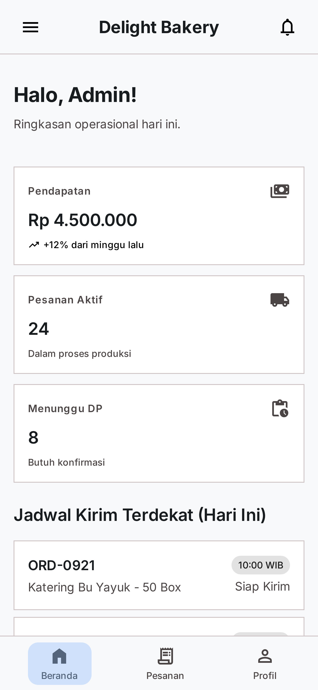

3. **Layar Daftar Pesanan (History Order Admin):** Menampilkan riwayat pesanan dengan filter status.
   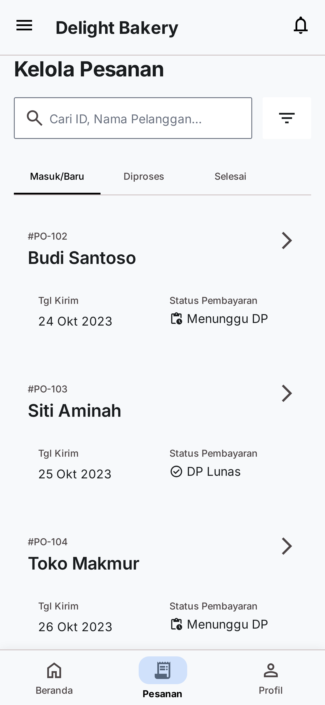

4. **Layar Detail Pesanan (Admin):** Menampilkan informasi pemesan, bukti DP, dan tombol ubah status.
   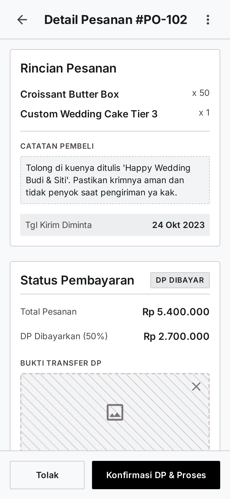

**Sisi Pelanggan:**

1. **Layar Login/Daftar Pelanggan:** Form bagi pelanggan untuk masuk/daftar agar riwayat pesanannya tersimpan.
   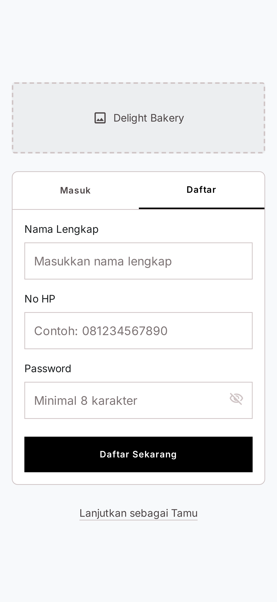

2. **Layar Katalog & Form PO (Pelanggan):** Menampilkan daftar menu dan input pesanan.
   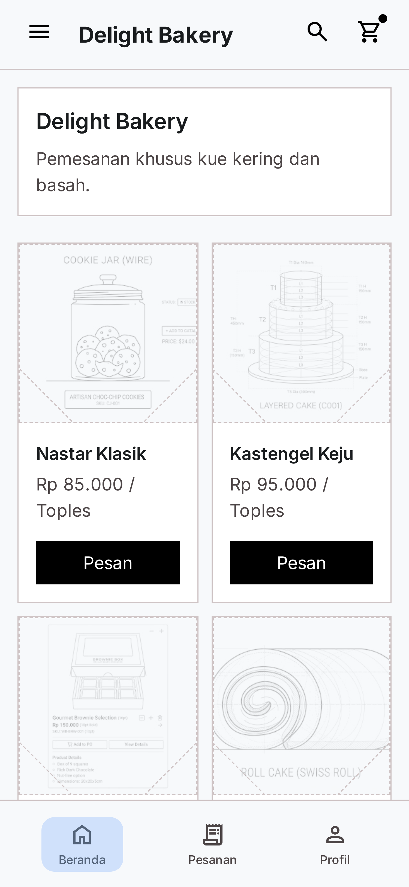

3. **Layar Pembayaran & Upload DP (Pelanggan):** Rincian total pesanan dan tombol unggah bukti pembayaran.
   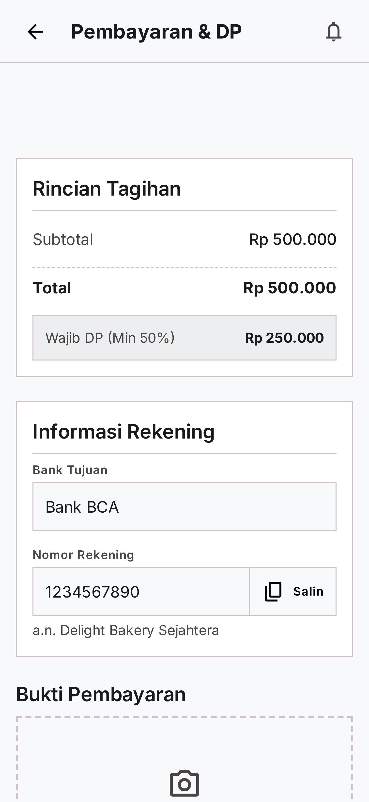

4. **Layar Riwayat Pesanan Saya (Pelanggan):** Daftar pesanan aktif dan riwayat/selesai pelanggan.
   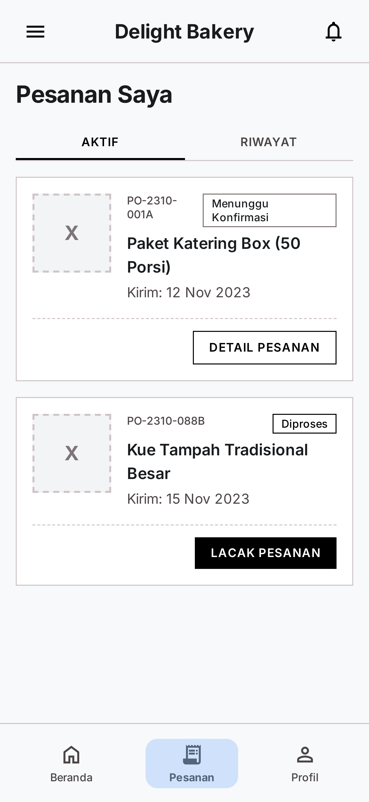

5. **Layar Lacak Pesanan / Detail (Pelanggan):** Menampilkan *timeline* status pesanan pelanggan.
   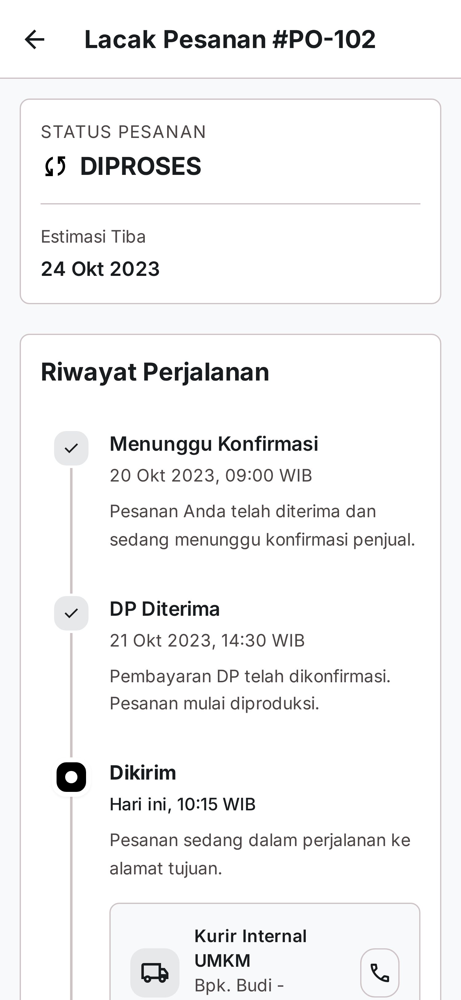

---

## 5. High-Fidelity Prototype (Two-Sided)
*Berikut adalah antarmuka pengguna (UI) yang sudah dilengkapi dengan warna, tipografi, dan gaya visual akhir yang menyerupai aplikasi sungguhan.*

**Sisi Admin:**

1. **Layar Login Admin:** Menampilkan login bergaya profesional untuk Admin.
   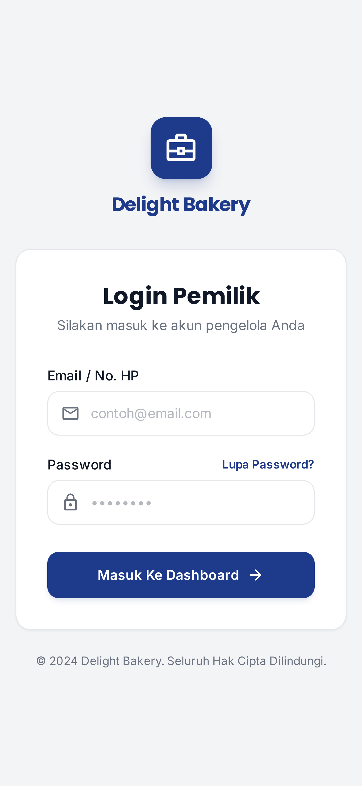

2. **Layar Dashboard Admin:** Visualisasi pendapatan dan performa dengan warna dan ikon.
   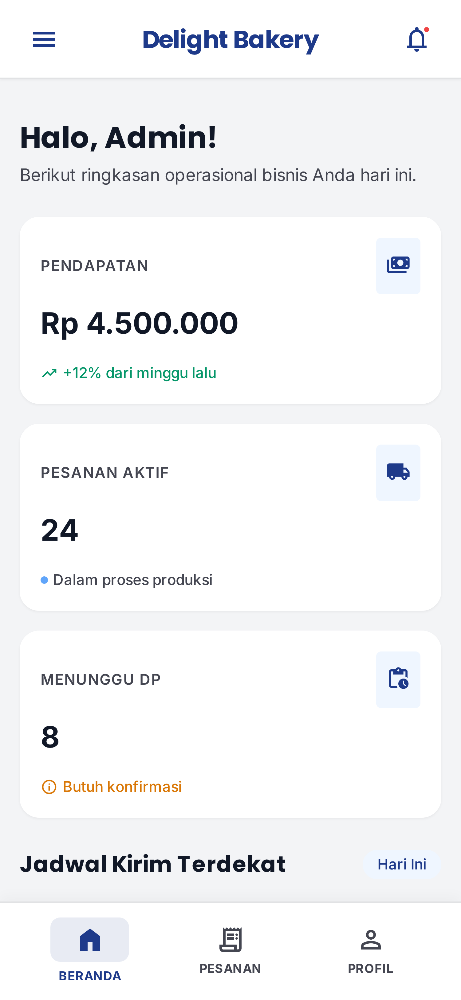

3. **Layar Daftar Pesanan (Kelola Pesanan):** Daftar interaktif dengan state warna yang jelas (seperti emerald untuk lunas).
   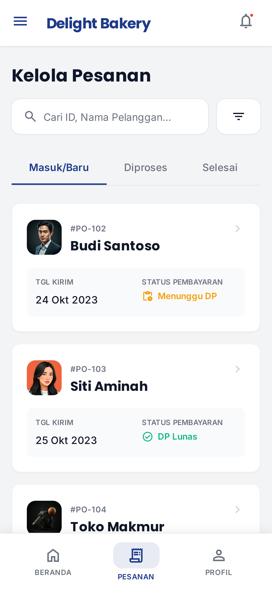

4. **Layar Detail Pesanan:** Rincian informasi beserta tombol aksi cepat.
   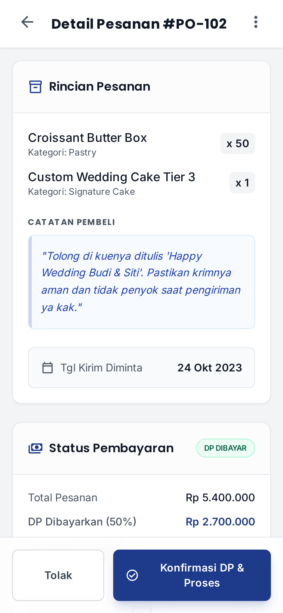

5. **Layar Profil Admin:** Info akun, statistik toko, pengaturan & keluar (logout).
   

**Sisi Pelanggan:**

1. **Layar Login Pelanggan:** Desain yang ramah dan *welcoming* dengan visual yang sesuai untuk pembeli.
   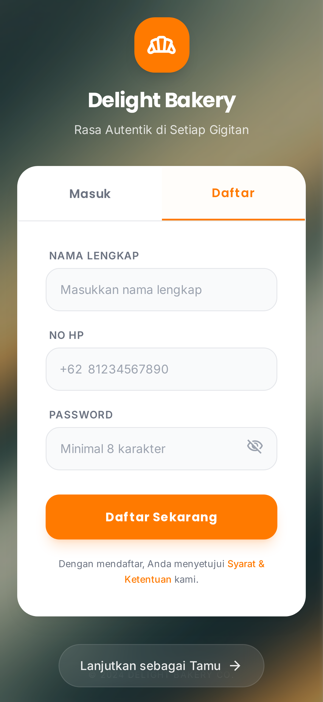

2. **Layar Katalog & Form PO:** Tampilan menggugah selera untuk memilih produk *bakery*.
   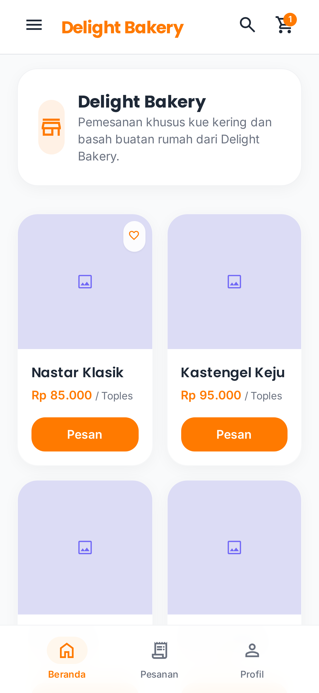

3. **Layar Pembayaran DP:** Panduan yang jelas untuk transfer dan upload bukti bayar.
   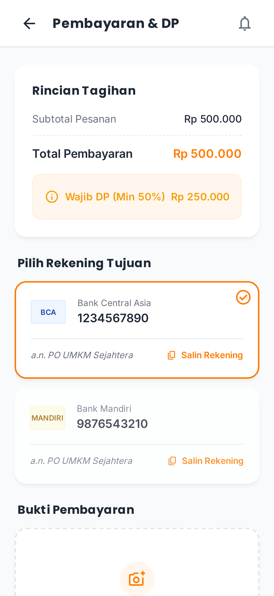

4. **Layar Riwayat Pesanan:** Memonitor status dengan kartu riwayat yang rapi.
   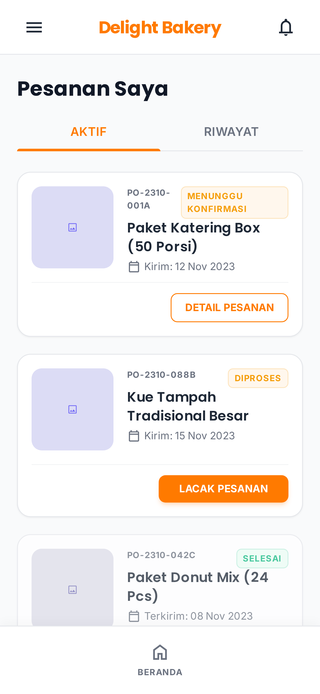

5. **Layar Lacak Pesanan:** *Timeline* proses dengan visualisasi warna hijau (*emerald*) untuk status selesai.
   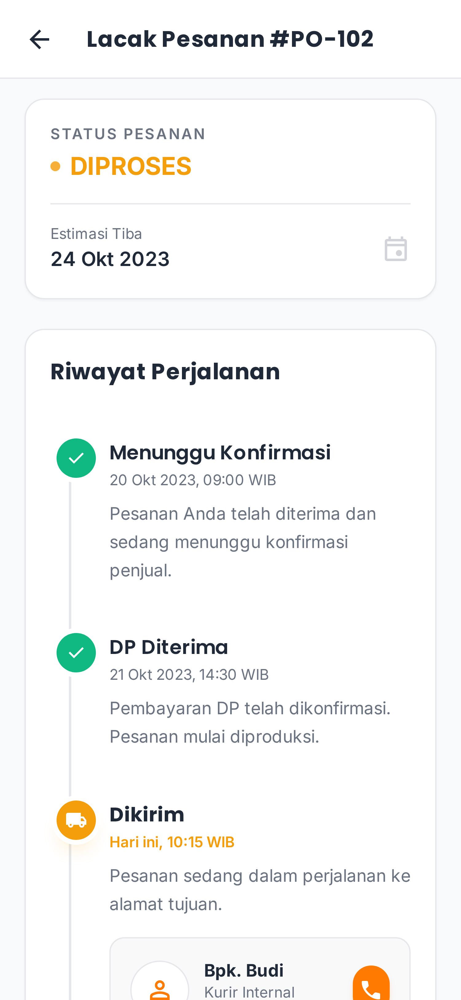

6. **Layar Profil Pelanggan:** Info akun, alamat tersimpan, bantuan & keluar (logout).
   

**Design System Sederhana:**
*   **Tipografi:** Poppins (untuk *Heading*) dan Inter (untuk *Body*).
*   **Warna Utama Pelanggan (B2C):** Oranye/Jingga hangat (seperti Amber/Orange) - diaplikasikan untuk tema aplikasi pelanggan agar menggugah selera dan bernuansa *bakery*.
*   **Warna Utama Admin (B2B/Dashboard):** Biru (Primary Blue `#1E3A8A`) - diaplikasikan khusus untuk *dashboard* admin guna memberikan kesan profesional, tepercaya, dan nyaman dibaca dalam waktu lama.
*   **Warna Status (State Colors):** 
    *   Hijau / Emerald `#10B981` (Lunas / Selesai / Konfirmasi)
    *   Kuning / Amber `#F59E0B` (Menunggu DP / Sedang Diproses)
    *   Merah / Rose `#EF4444` (Belum Bayar / Jatuh Tempo / Dibatalkan)
*   **Ikonografi:** Material Symbols Outlined (Google).

---

## 6. Usability Testing
*Diujikan kepada minimal 3 responden (campuran antara penjual UMKM dan pelanggan).*

*   **Tujuan Pengujian:** Mengukur tingkat kemudahan (*usability*) pelanggan dalam memesan PO secara mandiri dan kemudahan admin dalam memverifikasi pesanan tersebut.
*   **Skenario Tugas (Admin):** "Terdapat pesanan masuk baru dari pelanggan bernama Budi. Silakan verifikasi bukti transfer DP-nya dan ubah status pesanan menjadi sedang diproses."
*   **Skenario Tugas (Pelanggan):** "Anda ingin memesan 1 box Brownies kustom untuk dikirim tanggal 15 bulan depan. Lakukan pemesanan dan unggah bukti transfer DP sebesar Rp 50.000."
*   **Hasil Pengamatan:** 
    *   *Responden 1 (Berperan sebagai Admin):* [Isi dengan kelancaran/kesulitan yang dialami]
    *   *Responden 2 (Berperan sebagai Pelanggan):* [Isi dengan kelancaran/kesulitan yang dialami]
    *   *Responden 3 (...):* [Isi dengan kelancaran/kesulitan yang dialami]
*   **Temuan Utama:** [Isi dengan kesimpulan, misalnya: "Pelanggan sempat bingung menemukan lokasi upload bukti transfer DP" atau "Admin dengan mudah menemukan daftar pesanan hari ini karena hirarki visual yang jelas"]

---

## 7. Heuristic Evaluation
*Evaluasi desain berdasarkan 10 Heuristik Nielsen. Temukan 5 masalah berdasarkan hasil perancangan/pengujian (mencakup sisi admin dan/atau pelanggan).*

1.  **Masalah 1 (Sisi Pelanggan):** [Misal: Tidak ada indikator *loading* saat mengunggah foto bukti DP]
    *   **Prinsip yang Dilanggar:** *Visibility of system status*
    *   **Severity Rating:** [Skala 0-4]
    *   **Rekomendasi Perbaikan:** Tambahkan animasi *loading spinner* atau *progress bar* saat foto sedang diunggah.
2.  **Masalah 2 (Sisi Admin):** [Misal: Sulit mencari pesanan lama berdasarkan nama pelanggan]
    *   **Prinsip yang Dilanggar:** *Flexibility and efficiency of use*
    *   **Severity Rating:** [Skala 0-4]
    *   **Rekomendasi Perbaikan:** Tambahkan fitur kotak pencarian (*search bar*) dan filter tanggal di halaman daftar pesanan.
*(Ulangi format di atas hingga mendapatkan 5 Masalah yang merepresentasikan antarmuka admin dan pelanggan)*

---

## 8. Refleksi Desain
*Tuliskan refleksi singkat (1-2 halaman)*

*   **Pengalaman Membangun Aplikasi Dua Sisi (Two-Sided):**
    [Jelaskan tantangan yang Anda hadapi dalam menyeimbangkan kebutuhan Admin (fungsionalitas manajemen data yang padat) dengan kebutuhan Pelanggan (kemudahan eksplorasi menu dan proses transaksi yang ringkas).]
*   **Kejujuran dalam Proses Pengujian:**
    [Jelaskan bahwa Anda tidak mengarahkan/membantu user saat *Usability Testing*, dan merekam hasil secara objektif dari perspektif penjual maupun pembeli meskipun terdapat kekurangan pada prototipe Anda.]
*   **Inklusivitas dan Keadilan:**
    [Jelaskan pemilihan warna kontras, ukuran *font* yang memadai, dan penggunaan bahasa Indonesia yang kasual/sehari-hari agar aplikasi dapat diakses dengan mudah oleh berbagai demografi pelanggan dan penjual skala kecil.]
*   **Nilai Tambah/Dampak Sosial:**
    [Jelaskan bahwa perancangan antarmuka ini diharapkan dapat membangun ekosistem transaksi yang lebih transparan dan saling percaya antara UMKM dan pelanggan, mengurangi kerugian bisnis akibat PO tak tercatat, dan mendorong laju digitalisasi bisnis kecil.]

---

## 9. Tautan Penting
*   **Link Prototype Figma:** [Masukkan Link Figma di sini, pastikan setting "Anyone with the link can view"]
*   **Link Folder Google Drive Keseluruhan:** [Masukkan Link GDrive di sini]
